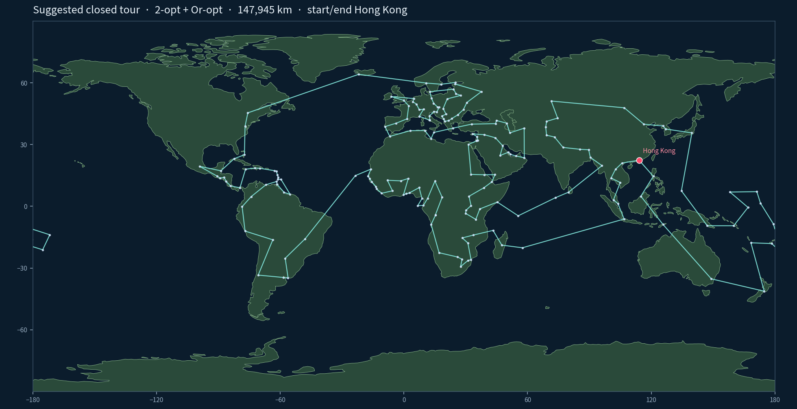

# Travel around the world

Closed great-circle tour of **196 places** (Hong Kong + 195 UN member/observer capitals): start in Hong Kong (HK), visit each capital **exactly once**, return to Hong Kong, minimise the sum of spherical distances.

This is a toy project for algorithm study and learning, a derivative of TSP heuristics using great circle distance as measurement, finding solution and explain with an interactive map on various algorithm

**Live site (GitHub Pages):** [https://rayony.github.io/travel-around-the-world/](https://rayony.github.io/travel-around-the-world/)



Coastlines: [Natural Earth 110m land](https://www.naturalearthdata.com/) (public domain). Teal line: suggested Hamiltonian cycle from Hong Kong. Red dot: Hong Kong. Straight segments on this plate-carrée plot; the interactive map draws great-circle arcs.

## Funny Fact:
Although the solution starts and ends in HK, similar route applies if you start from any capital in the world and include HK as one of the waypoint!

## Open the map (zh-HK / English)

Same tours, same numbers. Only the chrome and lesson text differ.

After Pages is on (`Settings → Pages → Deploy from a branch → main / docs`):

| Language | Live URL |
| --- | --- |
| Landing | https://rayony.github.io/travel-around-the-world/ |
| 繁體中文 (Hong Kong) | https://rayony.github.io/travel-around-the-world/hk_capital_tour_map.html |
| English | https://rayony.github.io/travel-around-the-world/hk_capital_tour_map.en.html |

In the repo the same files are:

| Language | File | `lang` |
| --- | --- | --- |
| 繁體中文 | [`docs/hk_capital_tour_map.html`](docs/hk_capital_tour_map.html) | `zh-Hant` |
| English | [`docs/hk_capital_tour_map.en.html`](docs/hk_capital_tour_map.en.html) | `en` |

Needs a network connection for Leaflet, NASA Blue Marble, and optional OSM WMS. GitHub’s *file preview* does not run the map.

Default basemap is **NASA Blue Marble** on `EPSG:4326` so city pins sit on the same equirectangular grid as the image (Hong Kong should fall on the east side of the Pearl River estuary).

## Assumption: UN membership list as of 2026-09-14

This project **follows the United Nations list of Member States and Non-Member Observer States**, snapshot date **14 September 2026**.

- https://www.un.org/en/about-us/member-states
- https://www.un.org/en/about-us/non-member-states

| Rule | What we do |
| --- | --- |
| Set of states | **193 members** (last new member: South Sudan, 14 July 2011) + **2 observers** (Holy See; State of Palestine since 29 November 2012) = **195** rows |
| Not on the UN pages | No Taiwan / Taipei, no Kosovo, no Western Sahara, no Macao, no other ISO territories |
| Extra 196th point | Hong Kong (CityID 0) is only the tour start/end. Nation cell `-`. Not a UN state |
| Names aligned 2026-09-14 | Cabo Verde, Czechia, Türkiye, Congo, Timor-Leste, State of Palestine, Holy See, Côte D'Ivoire |
| Capitals | Unchanged (Israel = Jerusalem, State of Palestine = Ramallah) |
| Not used | Full ISO 3166; any one country’s diplomatic recognition list |

Heuristic TSP only. Held–Karp is impossible at n = 196.

## Repository layout

| Path | What |
| --- | --- |
| `docs/index.html` | Pages landing (language picker) |
| `docs/hk_capital_tour_map.html` | Map + lesson, Traditional Chinese (zh-HK) |
| `docs/hk_capital_tour_map.en.html` | Same app, English UI |
| `docs/iEZm7.png` | Continent outline + suggested tour |
| `data/capitals_0-195.csv` | Cleaned CityID 0–195 |
| `data/SOURCES.md` | Imagery credits |
| `solvers/tsp_capitals.py` | Haversine + NN / farthest insertion / 2-opt / Or-opt / 3-opt |

Original workbook: `trial 0 - blind.xlsm`.

## Distance

Sphere radius **6371.0088 km**, haversine, 196×196 lookup table. PosX / PosY = `round(100 × lon/lat)` and are not used for length.

## Algorithms that were run (valid Hamiltonian cycles only)

| Method | km |
| --- | ---: |
| Nearest neighbour from HK | 173,672 |
| Multi-start NN, rotate cut to HK | 171,305 |
| Farthest insertion | 154,728 |
| Farthest insertion + 2-opt | 153,600 |
| 2-opt on multi-start NN | 149,529 |
| Simulated annealing (2-opt neighbourhood) | 149,529 |
| **2-opt + Or-opt + 2-opt** | **147,945** |
| 3-opt after Or-opt (legal cycles only) | 147,945 |

A shorter ~147,484 km 3-opt reused cities and was discarded. Held–Karp, Lin–Kernighan / LKH, and Concorde are taught in the HTML but were not executed.

```bash
python3 solvers/tsp_capitals.py --data data/capitals_0-195.csv --out output/tours.json
```

Python 3.9+, no third-party packages.

## Basemap licensing

**No Esri / ArcGIS Online tiles.** Those services need an Esri licence and prescribed attribution; they are not used.

- Default: NASA Blue Marble Next Generation (December, topography + bathymetry), loaded from NASA, not stored in the repo.  
  Item: https://visibleearth.nasa.gov/images/73909/december-blue-marble-next-generation-w-topography-and-bathymetry  
  JPEG: https://eoimages.gsfc.nasa.gov/images/imagerecords/73000/73909/world.topo.bathy.200412.3x5400x2700.jpg  
  Credit: NASA Earth Observatory / NASA Visible Earth.
- Optional: OSM as WMS in EPSG:4326 (© OpenStreetMap contributors, ODbL; renderer terrestris).
- README outline map: Natural Earth land 110m, public domain.

## Licence

Code and cleaned table: [MIT](LICENSE). OSM data and NASA imagery stay under their own terms.
